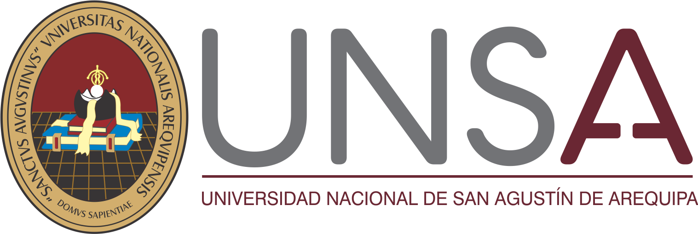

<div align="center">

<table>
    <thead>
        <tr>
            <td style="width:25%; text-align:center;">
                
            </td>
            <td style="text-align:center;">
                <b>UNIVERSIDAD NACIONAL DE SAN AGUSTÍN DE AREQUIPA</b><br>
                <b>FACULTAD DE INGENIERÍA DE PRODUCCIÓN Y SERVICIOS</b><br>
                <b>DEPARTAMENTO ACADÉMICO DE INGENIERÍA DE SISTEMAS E INFORMÁTICA</b><br>
                <b>ESCUELA PROFESIONAL DE INGENIERÍA DE SISTEMAS</b>
            </td>
            <td style="width:25%; text-align:center;">
                
            </td>
        </tr>
    </thead>
</table>

<br>



# Proyecto Final - Programación de Sistemas

### Administrador de Utilidades para Linux

</div>

---

# Información del curso

| Información | Detalle |
|------------|---------|
| **Curso** | Programación de Sistemas |
| **Semestre** | 2026 - A |
| **Docente** | Mg. Norman Patrick Harvey Arce |

---

# Integrantes

| N.º | Integrante |
|----:|-------------|
| 1 | Choque Sánchez, Alejandra Camila |
| 2 | Mamani Céspedes, Jhonatan Benjamin |
| 3 | Quispe Pauccar, Josue Claudio |
| 4 | Carrillo Villalta, Gustavo Alonso |

---

# Descripción

Este proyecto corresponde al desarrollo del trabajo final del curso de **Programación de Sistemas**.

El objetivo principal consiste en implementar una aplicación de consola para sistemas operativos Linux utilizando el lenguaje **C**, integrando diversas herramientas administrativas del sistema en una única interfaz basada en menús.

La aplicación busca facilitar la ejecución de tareas comunes de administración mediante módulos independientes, promoviendo el uso de llamadas al sistema, comandos de Linux y herramientas propias del sistema operativo.

Entre las funcionalidades que se implementarán se encuentran:

- Administración de procesos.
- Administración de archivos.
- Ejecución de comandos Linux.
- Sistema de respaldos.
- Analizador de scripts Bash.
- Cola de descargas.

Cada módulo fue diseñado para ser independiente, facilitando el mantenimiento y la incorporación de nuevas funcionalidades durante el desarrollo del proyecto.

---

# Objetivos

## Objetivo general

Desarrollar una aplicación de consola en lenguaje C que permita administrar diferentes recursos del sistema operativo Linux mediante una interfaz sencilla, modular e intuitiva.

## Objetivos específicos

- Implementar una arquitectura modular basada en archivos fuente y encabezados.
- Aplicar llamadas al sistema y comandos propios de Linux.
- Facilitar la administración de procesos del sistema.
- Automatizar tareas administrativas frecuentes.
- Aplicar buenas prácticas de programación estructurada.
- Mantener un proyecto organizado y escalable.

---

# Requisitos del sistema

Se recomienda utilizar:

- Ubuntu 22.04 o superior.
- GCC.
- Make.
- Bash.
- Git.

# Instalación

## 1. Clonar el repositorio

```bash
git clone https://github.com/JosueClaudioQP/ProyectoFinal_Psis.git
```

Ingresar al directorio del proyecto:

```bash
cd ProyectoFinal_Psis
```

---

## 2. Instalar dependencias

El proyecto incluye un script que instala automáticamente todas las herramientas necesarias para la compilación y ejecución.

Dar permisos de ejecución:

```bash
chmod +x requirements.sh
```

Ejecutar el instalador:

```bash
./requirements.sh
```

El script instalará automáticamente los siguientes paquetes:

| Paquete | Descripción |
|----------|-------------|
| build-essential | Herramientas básicas de compilación |
| gcc | Compilador de lenguaje C |
| make | Automatización de compilación |
| gdb | Depuración de programas |
| git | Control de versiones |
| tree | Visualización de estructuras de directorios |
| procps | Utilidades para administración de procesos |
| psmisc | Herramientas adicionales como `pstree` |
| rsync | Sincronización y respaldo de archivos |
| curl | Descarga de archivos mediante HTTP |
| wget | Descarga de archivos desde Internet |
| zip | Compresión de archivos |
| unzip | Descompresión de archivos |

---

## 3. Compilar el proyecto

Una vez instaladas las dependencias, ejecutar:

```bash
make
```

Al finalizar correctamente se generará el ejecutable:

```text
admin_linux
```

---

## 4. Ejecutar la aplicación

Puede ejecutarse mediante cualquiera de las siguientes opciones:

```bash
make run
```

o directamente

```bash
./admin_linux
```

---

## 5. Limpiar archivos generados

Para eliminar archivos objeto y el ejecutable:

```bash
make clean
```

---

# Estructura del proyecto

```text
ProyectoFinal_Psis
│
├── backups/
├── docs/
├── downloads/
├── historial/
├── img/
├── include/
├── logs/
├── scripts/
├── src/
├── .gitignore
├── Makefile
├── README.md
└── requirements.sh
```

Cada directorio cumple una función específica dentro de la arquitectura del proyecto.

| Directorio | Descripción |
|------------|-------------|
| **backups** | Almacenamiento de respaldos generados por el sistema. |
| **docs** | Documentación técnica y material relacionado con el proyecto. |
| **downloads** | Archivos administrados por el módulo de descargas. |
| **historial** | Registro de acciones realizadas por los diferentes módulos. |
| **img** | Imágenes utilizadas en el README y documentación. |
| **include** | Archivos de cabecera (.h) con la declaración de funciones. |
| **logs** | Archivos de registro del funcionamiento del sistema. |
| **scripts** | Scripts auxiliares utilizados por la aplicación. |
| **src** | Implementación completa del código fuente del proyecto. |

---

# Arquitectura del proyecto

La aplicación fue diseñada siguiendo una arquitectura modular.

Cada módulo se implementa mediante un archivo de cabecera (`.h`) y un archivo fuente (`.c`), permitiendo mantener el código organizado y facilitando futuras ampliaciones.

La estructura principal está compuesta por los siguientes archivos:

| Archivo | Función |
|----------|---------|
| `main.c` | Punto de entrada de la aplicación. |
| `menu.c` | Administración del menú principal y navegación entre módulos. |
| `procesos.c` | Gestión de procesos del sistema operativo. |
| `archivos.c` | Administración de archivos y directorios. |
| `comandos.c` | Ejecución de comandos Linux. |
| `backup.c` | Sistema de respaldos. |
| `bash_parser.c` | Analizador de scripts Bash. |
| `descargas.c` | Administración de la cola de descargas. |
| `util.c` | Funciones auxiliares utilizadas por todo el proyecto. |

Cada uno de estos archivos posee su correspondiente archivo de cabecera dentro del directorio `include`, donde se definen los prototipos de funciones y las estructuras necesarias para la comunicación entre módulos.

Esta organización permite que cada integrante del equipo trabaje sobre un módulo independiente sin afectar el funcionamiento general de la aplicación.
# Módulos del proyecto

El proyecto se encuentra organizado en módulos, donde cada uno implementa una funcionalidad específica del sistema operativo Linux.

| Módulo | Estado |
|---------|:------:|
| Administrador de procesos
| Administrador de archivos
| Comandos Linux
| Sistema de respaldos
| Analizador Bash
| Cola de descargas

---

# Módulo 1 - Administrador de Procesos

El Administrador de Procesos constituye el primer módulo funcional del proyecto.

Su finalidad es permitir al usuario consultar y administrar los procesos que se encuentran en ejecución dentro del sistema operativo Linux mediante una interfaz interactiva desarrollada completamente en lenguaje C.

Este módulo integra comandos propios del sistema operativo con llamadas realizadas desde la función `system()`, proporcionando una experiencia sencilla para el usuario final.

---

## Funcionalidades implementadas

Actualmente el módulo ofrece las siguientes funcionalidades:

- Listado completo de procesos activos.
- Visualización ordenada por porcentaje de uso de CPU.
- Búsqueda de procesos por nombre.
- Finalización segura de procesos mediante PID.
- Suspensión temporal de procesos.
- Reanudación de procesos suspendidos.
- Visualización del árbol de procesos.
- Validación de existencia del PID antes de ejecutar operaciones.
- Registro automático de acciones realizadas.
- Información general del sistema antes de acceder al menú.

---
# Tecnologías utilizadas

El proyecto fue desarrollado utilizando herramientas propias del entorno GNU/Linux y el lenguaje de programación C.

| Tecnología | Descripción |
|------------|-------------|
| C | Lenguaje principal utilizado para el desarrollo del proyecto. |
| GCC | Compilador del lenguaje C. |
| GNU Make | Automatización del proceso de compilación. |
| Bash | Automatización mediante scripts y ejecución de comandos del sistema. |
| Git | Control de versiones del proyecto. |
| GitHub | Plataforma para el alojamiento y colaboración del código fuente. |
| Ubuntu Linux | Sistema operativo utilizado durante el desarrollo. |

---

# Arquitectura de desarrollo

El proyecto fue desarrollado siguiendo una arquitectura modular.

Cada módulo se implementa de manera independiente mediante un archivo fuente (`.c`) y un archivo de cabecera (`.h`), permitiendo:

- Separación de responsabilidades.
- Fácil mantenimiento del código.
- Trabajo colaborativo entre los integrantes.
- Escalabilidad para futuras funcionalidades.
- Reutilización de funciones comunes.

La comunicación entre módulos se realiza mediante los archivos ubicados en el directorio `include`, mientras que toda la implementación se encuentra en `src`.

---

# Flujo general de ejecución

El funcionamiento general de la aplicación sigue el siguiente flujo:

```text
                Inicio
                   │
                   ▼
             main.c
                   │
                   ▼
          menu_principal()
                   │
      ┌────────────┼────────────┐
      ▼            ▼            ▼
 Procesos     Archivos     Comandos
      │            │            │
      ▼            ▼            ▼
   Backup     Bash Parser   Descargas
                   │
                   ▼
                 Salida
```

Este diseño permite agregar nuevos módulos sin modificar la estructura principal del proyecto.

---

# Estado actual del proyecto

Actualmente el proyecto se encuentra en desarrollo.

## Módulos implementados

- ✅ Administrador de procesos.

## Módulos pendientes

- 🚧 Administrador de archivos.
- 🚧 Comandos Linux.
- 🚧 Sistema de respaldos.
- 🚧 Analizador de scripts Bash.
- 🚧 Cola de descargas.

La arquitectura principal del proyecto ya ha sido definida, permitiendo continuar con la implementación de los módulos restantes de manera independiente.

---

# Posibles mejoras futuras

Como parte de la evolución del proyecto, se consideran las siguientes mejoras:

- Incorporar colores en la interfaz utilizando códigos ANSI.
- Implementar archivos de configuración.
- Agregar confirmaciones avanzadas para operaciones críticas.
- Mejorar el manejo de errores y excepciones.
- Incorporar registros independientes para cada módulo.
- Implementar validaciones adicionales sobre entradas del usuario.
- Añadir estadísticas del sistema en tiempo real.
- Integrar monitoreo de recursos del sistema.
- Mejorar la interfaz del menú principal.

---

# Buenas prácticas aplicadas

Durante el desarrollo del proyecto se siguieron las siguientes prácticas:

- Organización modular del código fuente.
- Separación entre implementación y declaraciones.
- Uso de archivos de cabecera para compartir funciones.
- Uso de Git como sistema de control de versiones.
- Documentación del proyecto mediante README.
- Organización de directorios por funcionalidad.
- Uso de Make para automatizar la compilación.
- Registro de acciones relevantes del sistema.
- Nombres descriptivos para funciones y archivos.

---

# Contribución

Para contribuir al desarrollo del proyecto:

1. Crear una nueva rama.

```bash
git checkout -b nombre-rama
```

2. Realizar los cambios correspondientes.

3. Compilar el proyecto.

```bash
make
```

4. Confirmar los cambios.

```bash
git add .
git commit -m "Descripción de los cambios"
```

5. Enviar la rama al repositorio.

```bash
git push origin nombre-rama
```

6. Crear un Pull Request para su revisión.


---

# Agradecimientos

Los autores expresan su agradecimiento a la **Escuela Profesional de Ingeniería de Sistemas** de la **Universidad Nacional de San Agustín de Arequipa**, así como al docente **Mg. Norman Patrick Harvey Arce**, por la orientación brindada durante el desarrollo del presente proyecto y de todo el curso.

---

<div align="center">

### Universidad Nacional de San Agustín de Arequipa

**Escuela Profesional de Ingeniería de Sistemas**

**Programación de Sistemas — Proyecto Final**

2026 - A

</div>